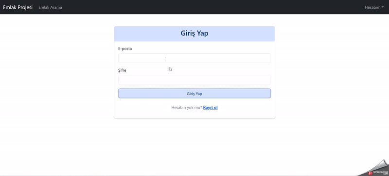
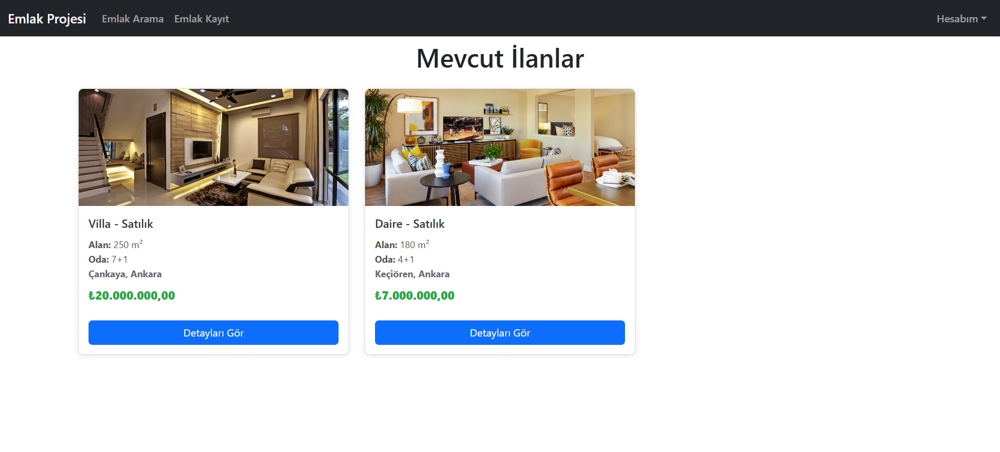
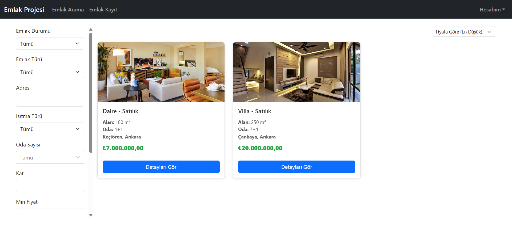
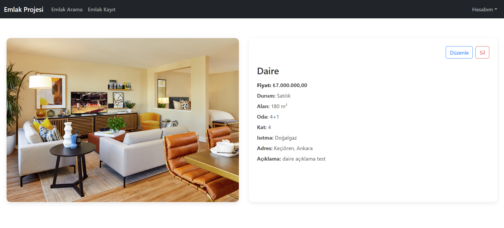
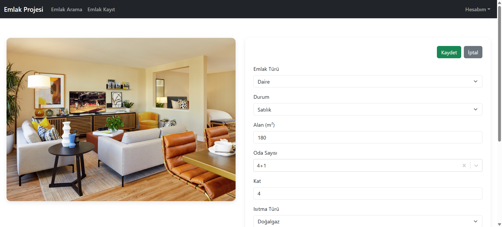
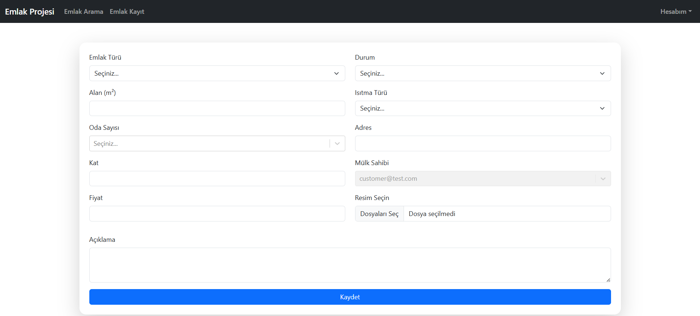
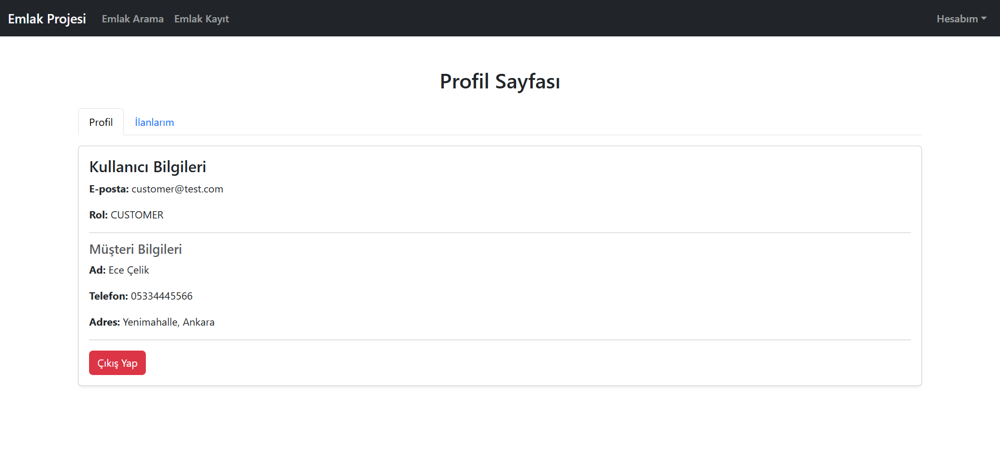
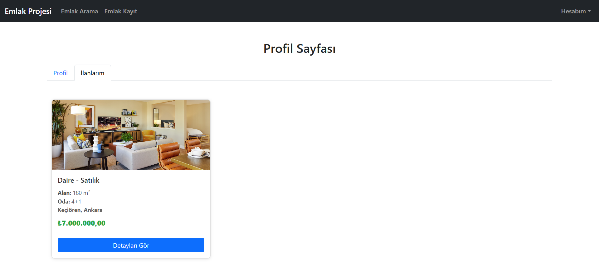

Proje Tanıtımı
Bu proje, bir emlak otomasyon sisteminin hem ön hem de arka uç geliştirme aşamalarını kapsamaktadır. Sistem, emlak ilanlarının listelenmesi, aranması ve yönetilmesi gibi temel işlevleri sunar.

Proje Yapısı
Proje, modern bir mimariyle backend ve frontend olmak üzere iki ana bölümden oluşur.

backend: Java ve Spring Boot kullanılarak geliştirilmiş, RESTful API servislerini barındıran kısımdır.

frontend: React.js kullanılarak geliştirilmiş, kullanıcı arayüzünü ve kullanıcı etkileşimlerini yöneten kısımdır.

Ekran Görüntüleri
Uygulamamızın çalışır halini gif olarak ve çeşitli arayüzlerini görsel olarak aşağıda görebilirsiniz. Video linki aşağıdadır, indirip inceleyebilirsiniz.

[https://github.com/mertkurtoglu/fonet-project/blob/main/fonet.mp4](https://github.com/mertkurtoglu/fonet-project/raw/refs/heads/main/fonet.mp4)

